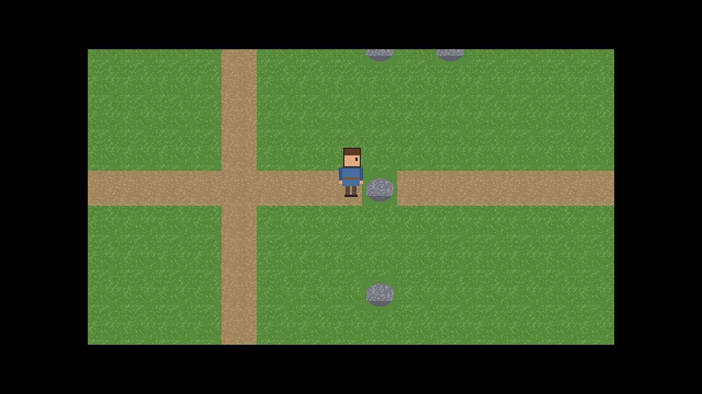
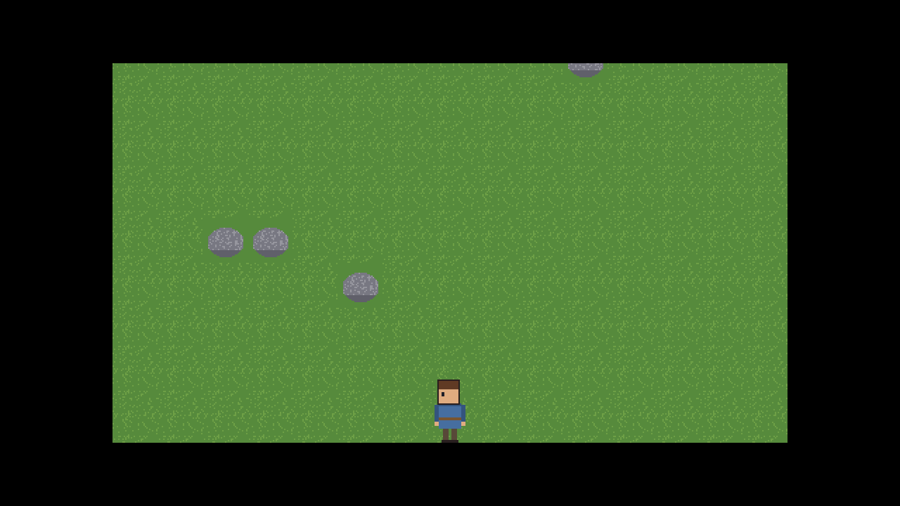

# Project Odyssey: assembly progress (8)

## AP-009 · 2026-09-30 · after US-024 and the M1 exit review: **Luna works**

| | |
|---|---|
| Codex / requirements | v1.3 / v1.4 |
| Repository | `qa` CI green (12/12 Debug and Release, including real-window tests on GitHub); `main` gets `qa` now and is tagged **`m1-done`** |
| Milestone | **M1 Luna engine: 5 of 5, exit review met** ([gate](docs/gates/M1.md)) |
| Next | **K-M2 and the console clan simulator** (US-010..US-016), ending at **Kill Gate 1**, where you read the chronicle |

### You can play it
Run `build\windows-x64\bin\Release\odysseus.exe` (after building) and walk the hero with **WASD, the arrow keys or a gamepad**. Rocks and water block the way, and the camera follows.

| Walked into the boulder (US-024) | At the edge of the world (M1 exit) |
|---|---|
|  |  |

### Story just finished: US-024 Walk the character around the map
- 8-way walking at 3 tiles per second with a 4-frame walking animation; stops flush against rocks and water; idle facing the last direction; drawn smoothly between ticks.
- Proven by unit tests and an end-to-end test that plays the real game: holding Move Right for 3 s stops the hero at x 1142.0, flush with the boulder at x 1152.

### M1 in one table
| Luna feature | Story |
|---|---|
| Window, fixed 20 Hz game loop, 60 FPS with VSync, clean close | US-020 |
| Keyboard + gamepad -> intents (Move, Interact, Menu) | US-021 |
| Crisp pixel art: 480x270 virtual screen, whole-number scaling, letterbox | US-022 |
| Tile map (only visible tiles drawn), smooth camera clamped to the world | US-023 |
| Collisions, walking hero, scripted input, screenshots | US-024 |

### Delegated decisions awaiting your review
D-16 (32x32 tiles), D-17 (8-way movement), placeholder art drawn by code until D-05 (M3). See docs/decisions.md.

### Progress: **10 / 44 stories** (M0 4/4, M1 5/5). Two of seven milestones done.
