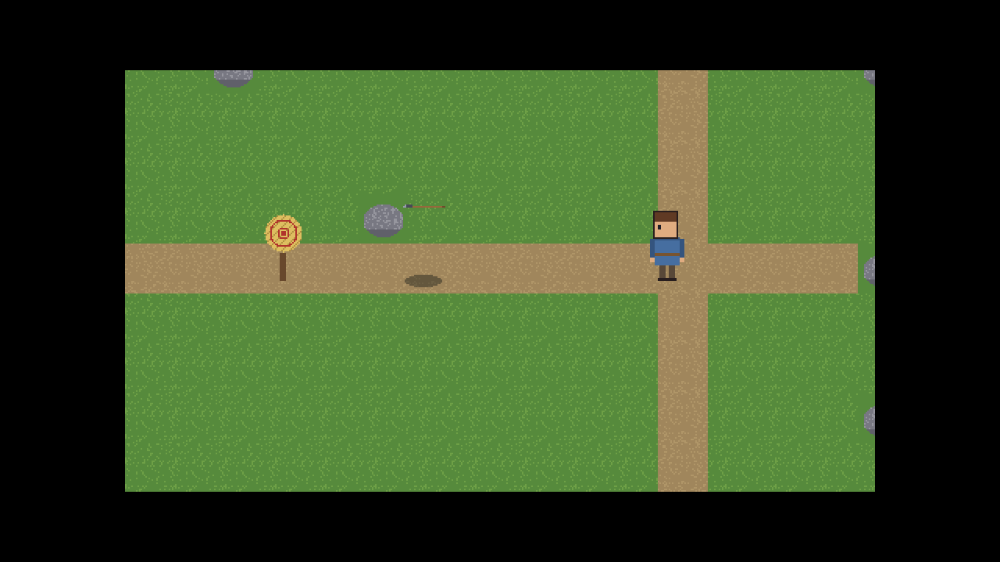

# Project Odyssey: assembly progress (16)

## AP-017 · 2026-09-30 · M1b done: Luna Physics

| | |
|---|---|
| Codex / requirements | v1.5 / v1.5 |
| Repository | `main` tagged **`m1b-done`** (CI green on main, [run 36650998170](https://github.com/marius-stoian/Project-Odyssey/actions/runs/36650998170)); `qa` is this snapshot's commit |
| Milestone | **M1b Luna Physics: Done** (5 of 5, exit review met) |
| Next | S-US-011 (M2 resumes; work on branch `story/US-011` is verified locally) |

### Milestone finished: M1b Luna Physics
The exit review is [docs/gates/M1b.md](../../gates/M1b.md). Every criterion met:
- **Identical on every build**: one million mixed math operations hash to 17224312723153614174, and a whole-physics run (throws with drag and wind, a bouncing ball, 1,000 bodies colliding) to 17309765312882650619, in Debug, Release and on GitHub's machines.
- **Textbook checks**: throw range 40.70 m vs v^2/g = 40.77 m; drag and wind within 0.2% of the drag equation; bounces 0.25, 0.0625, 0.0156 m (e^2 each time); friction stop 1.22597 m vs v^2/(2 mu g) = 1.22597 m.
- **In the game**: the hero throws a spear that flies in an arc with a shadow and hits the straw target.

### Worth knowing
- CI flake: on the gate commit, GitHub's runner took 3150 ms to show the first window frame in Debug (US-020's limit is 3000 ms); the five runs before passed and the re-run passed. The test was not weakened. If it keeps happening on GitHub's machines, the team will raise a codex issue about the limit on CI (on your PC it is about 0.3 s).

### Milestones
| ID | Milestone | Stories done | State |
|---|---|---|---|
| M0 | Tooling ready | 4 / 4 | Done, `m0-done` |
| M1 | Luna engine: walking skeleton | 5 / 5 | Done, `m1-done` |
| M1b | Luna Physics | 5 / 5 | **Done, `m1b-done`** |
| M2 | Console clan simulator (KILL GATE 1) | 1 / 7 | In progress (US-011 next) |
| M3-M6 | | 0 / 28 | |
| | **MVP total** | **15 / 49** | |

### Decisions and codex issues
- No new decisions. Awaiting your review (delegated to Dominus): D-02, D-16, D-17.
- No new codex issues.
