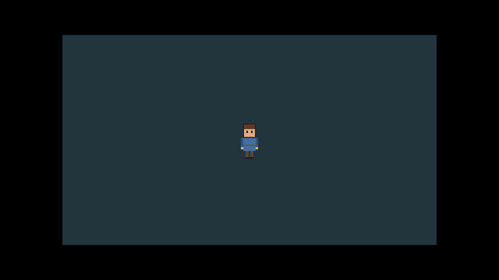

# Project Odyssey: assembly progress (6)

## AP-007 · 2026-09-30 · after US-022

| | |
|---|---|
| Codex / requirements | v1.3 / v1.4 |
| Repository | `qa` @ `5ce489b` (CI for US-021 green; US-022 CI running at save time) |
| Milestone | **M1 Luna engine: 3 of 5** |
| Next | S-US-023 tile map and a following camera |

### Story just finished: US-022 Draw sprites with crisp pixels
The hero is on screen, drawn as pixel art on a 480 x 270 virtual screen and scaled by whole numbers only:

- Proven on real pixels: a hidden 1920 x 1080 window scales exactly x4 (1024 screen pixels checked, 0 wrong); 1366 x 768 scales x2 with black bars.
- Luna now has a `Renderer` interface (ADR-003), textures, screenshots (`odysseus.exe --screenshot file.bmp`), and code-drawn placeholder art: a 32x48 hero in 8 directions x 4 walking frames, and 32x32 tiles.
- [Plan and evidence](../../plans/stories-M1.md#us-022).

### Delegated decisions: none new (D-16, D-17 from US-020 still await your review).
### Progress: **8 / 44 stories** (M0 4/4, M1 3/5)
