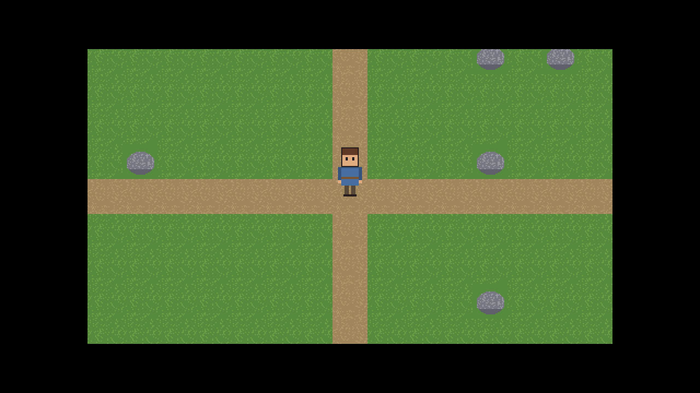

# Project Odyssey: assembly progress (7)

## AP-008 · 2026-09-30 · after US-023

| | |
|---|---|
| Codex / requirements | v1.3 / v1.4 |
| Repository | `qa` @ `399b129` |
| Milestone | **M1 Luna engine: 4 of 5** |
| Next | S-US-024 walk the character around the map, then X-M1 |

### Story just finished: US-023 Show a tile map with a following camera
The hero now stands in a 64 x 64 test valley: grass, crossing paths, rocks and a pond, seen through Luna's camera:

- Luna draws only the tiles the camera sees (about 135 of 4096); proven by counting draws.
- The camera glides a quarter of the way to its target each tick, is blended between ticks, and stops at the world's edges.
- [Plan and evidence](../../plans/stories-M1.md#us-023).

### Delegated decisions: none new. D-16 (32x32 tiles) and D-17 (8-way movement) await your review.
### Progress: **9 / 44 stories** (M0 4/4, M1 4/5)
